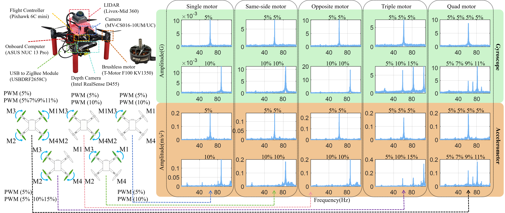
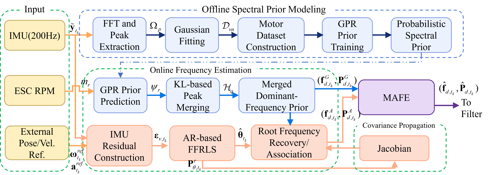

# MAFE: Model-Augmented Adaptive Frequency Estimation for UAV Inertial Sensing Under Maneuver-Dependent Vibration

> **⚠️ Notice:** This repository contains **partial** source code for the MAFE algorithm. The complete codebase will be released upon paper acceptance. Stay tuned!

---

## 🔍 Problem Description

Low-cost UAV IMUs suffer from severe motor-induced vibration noise during dynamic maneuvers. As motor speeds vary with thrust and attitude changes, the dominant vibration frequencies shift and even split/merge across rotors, making fixed-frequency filtering ineffective.

<p align="center">
  
</p>
<p align="center"><em>Fig. 1: IMU vibration spectrum evolution — (a) from single-motor to four-motor rotation; (b) under prescribed pitch/roll angles. The spectral peaks shift, merge, and split as motor speeds change during maneuvering.</em></p>

---

## 🏗️ Framework Overview

MAFE addresses this challenge through a **model-augmented adaptive frequency estimation** pipeline:

<p align="center">
  
</p>
<p align="center"><em>Fig. 2: Overall framework of the proposed MAFE method. Key stages: (1) IMU spectrum Gaussian fitting for peak identification, (2) Pose-to-virtual-IMU for vibration residual isolation, (3) Shared GPR model for motor-speed-conditioned frequency prediction, (4) AR-FFRLS adaptive tracking, and (5) Kalman filter integration with GPR-predicted noise covariance.</em></p>

---

> **📌 Note**
> 
> This repository currently contains **three key modules** of the MAFE framework:
> - IMU spectrum Gaussian fitting
> - Pose-to-virtual-IMU derivation
> - Shared GPR frequency model
> 
> The **full MAFE codebase**, including additional modules (e.g., KL/SKL divergence analysis, AR-FFRLS online tracking, Kalman filter integration, and complete experimental pipelines), will be released **upon paper acceptance**.
> 
> If you have any questions or collaboration inquiries, please feel free to contact us.

---

## 📄 Abstract

<!-- TODO: 在此填写你的论文摘要 -->

Accurate estimation of motor-induced vibration noise frequencies is critical for UAV state estimation and control. This repository provides key modules of the **MAFE (Model-Augmented Adaptive Frequency Estimation)** framework, including:

1. **IMU Spectrum Gaussian Fitting** — Extracting vibration spectral peaks from raw IMU data via FFT + Gaussian peak fitting.
2. **Pose-to-Virtual-IMU** — Deriving a low-frequency reference IMU from pose/odometry to isolate vibration residuals.
3. **Shared GPR Frequency Model** — Training a shared Gaussian Process Regression model across all motors for vibration frequency prediction.

---

## 🗂️ Repository Structure

```
MAFE/
├── README.md                                          # Main README (this file)
├── LICENSE                                            # License file
├── .gitignore
├── figures/                                           # Result figures
│   ├── fig_vibration_problem.png                      #   Motor vibration spectrum (问题说明)
│   ├── fig_overall_framework.png                      #   MAFE overall framework (框架介绍)
│   ├── fig_imu_spectrum_fitting.png
│   ├── fig_gpr_frequency_prediction.png
│   ├── fig_pose_virtual_imu.png
│   └── fig_mafe_overview.png
├── imu_spectrum_gaussian_fit_cn_annotated/            # [Module 1] IMU spectrum Gaussian fitting
│   ├── README.md
│   ├── include/
│   ├── src/
│   ├── config/
│   ├── launch/
│   ├── scripts/
│   ├── examples/
│   └── docs/
├── pose_to_virtual_imu_package/                       # [Module 2] Pose to virtual IMU
│   ├── matlab/                                        #   MATLAB offline version
│   └── ros_pose_to_virtual_imu/                       #   ROS C++ online node
└── gpr_shared_frequency_model/                        # [Module 3] Shared GPR frequency model
    ├── README.md
    ├── include/
    ├── src/
    ├── config/
    ├── launch/
    ├── scripts/
    └── examples/
```

---

## 🔧 Modules Overview

### 1. IMU Spectrum Gaussian Fitting (`imu_spectrum_gaussian_fit_cn_annotated`)

Extracts vibration noise spectral peak parameters from 6-axis IMU time-domain data using FFT + Ceres-based Gaussian peak fitting.

- **Input:** 6-column CSV (gyro_x, gyro_y, gyro_z, acc_x, acc_y, acc_z)
- **Processing:** De-mean → Hann window → FFTW single-sided spectrum → 3-axis magnitude synthesis → detect 4 candidate peaks → local Gaussian fitting
- **Output:** Dominant frequencies `f_d`, variances `σ²`, left/right boundaries `f_L`, `f_R`

$$
S(f) = A \exp\left(-\frac{(f - \mu)^2}{2\sigma_f^2}\right)
$$

### 2. Pose-to-Virtual-IMU (`pose_to_virtual_imu_package`)

Derives a virtual (reference) IMU from pose/odometry trajectories to cancel low-frequency maneuvering components from raw IMU measurements.

- **Principle:** `IMU_residual = IMU_measured − IMU_virtual`
- **MATLAB version:** Offline debugging, compatible with MATLAB 2016a+
- **ROS version:** Real-time C++ node subscribing to `/odom` or `/pose`, publishing `/virtual_imu_from_pose`

### 3. Shared GPR Frequency Model (`gpr_shared_frequency_model`)

Trains a **four-motor shared** Gaussian Process Regression model to predict vibration dominant frequencies from motor speeds.

- **Key idea:** Instead of training 4 separate models, a single shared equivalent motor model `f_d = g(m)` is used.
- **Input:** Motor speeds `[m1, m2, m3, m4]` (from experimental database)
- **Output:** Predicted dominant frequencies `[μ1, σ1², μ2, σ2², μ3, σ3², μ4, σ4²]`
- **GPR Kernel:** Matérn kernel

---

## 🚀 Quick Start

### Prerequisites

- **OS:** Ubuntu 20.04 / 22.04
- **ROS:** ROS1 (Noetic) with Catkin workspace
- **Dependencies:**
  ```bash
  sudo apt-get install ros-${ROS_DISTRO}-roscpp ros-${ROS_DISTRO}-std-msgs \
    libeigen3-dev libfftw3-dev libceres-dev
  ```

### Build

```bash
cd ~/catkin_ws/src
cp -r imu_spectrum_gaussian_fit_cn_annotated .
cp -r pose_to_virtual_imu_package/ros_pose_to_virtual_imu .
cp -r gpr_shared_frequency_model .
cd ~/catkin_ws
catkin_make
source devel/setup.bash
```

### Run Each Module

See individual module READMEs for detailed usage:

- [IMU Gaussian Fit README](imu_spectrum_gaussian_fit_cn_annotated/README.md) ([中文](imu_spectrum_gaussian_fit_cn_annotated/README_zh.md))
- [GPR Model README](gpr_shared_frequency_model/README.md) ([中文](gpr_shared_frequency_model/README_zh.md))

---

## 📊 Results

The figures above demonstrate the effectiveness of the MAFE framework. (Detailed description to be added upon paper publication.)

---

## 📝 Citation

If you find this work useful, please consider citing:

```bibtex
@article{mafe2025,
  title     = {MAFE: Model-Augmented Adaptive Frequency Estimation for UAV Inertial Sensing Under Maneuver-Dependent Vibration},
  author    = {/* TODO: 填写作者 */},
  journal   = {/* TODO: 填写期刊/会议 */},
  year      = {2025},
  note      = {Code available at: https://github.com/你的用户名/MAFE}
}
```

---

## 📜 License

This project is licensed under the [MIT License](LICENSE).

---

## 📧 Contact

For questions or collaborations, please contact: tech.tjx@hotmail.com

---

**⭐ If you find this repository helpful, please consider giving it a star!**
